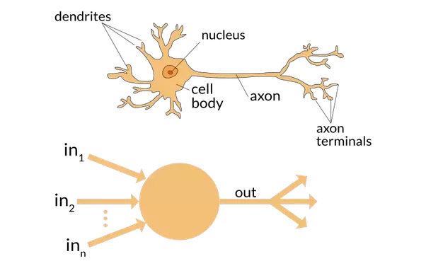

## Introduction

The computer technique deep learning has received much attention in the recent years to due to its flexibility and applicability in various fields, including natural language processing (NLP), computer vision and robotics. Deep Learning extracts and transforms data using multiple layers of neural networks. Each layer successively refines its input data and then passes the result on as input to the next layer. The layers utilise algorithms to minimize their errors and improve their accuracy. Through this process, the network learns to perform specified tasks.

The present blog post describes a brief history of deep learning.

## Journey

The starting point was the development of a mathematical model of an artificial neuron by the neurophysiologist Warren McCulloch together with the logician Walter Pitts in 1943. In their paper "A Logical Calculus of the Ideas Immanent in Nervous Activity" they presented the idea of a simplified model of a real neuron represented by simple addition and thresholding.

The following figure depicts a neuron and its logical (artificial) equivalent. McCulloch and Pitts states that the nervous system consists of a network of neurons, each with a soma (nucleus, cell body) and an axon. Their connections, the synapses, are always between the axon of one neuron and the soma of another neuron. At any given time, a neuron has a threshold value that an excitation must exceed in order to trigger an impulse. 

In 1960, the psychologist Frank Rosenblatt desinged and built the "Mark I Perception" computer based on the principles developed by McCulloch and Pitts, and further developed the concept by giving artificial neurons the ability to learn. The Perceptron (neural network) was able to successfully recognise simple shapes.

In 1968, the computer scientist Marvin Minsky and the mathematician Seymor Papert published the book "Perceptrons: an introduction to computational geometry". In it, they stated that a single layer cannot learn the simple but critical mathematical function XOR and explained that this limitation could be overcome by using multiple layers. It is believed that only the first of these two findings was accepted and that academic research on neural networks was consequently dormant for a long time.

In 1986, the psychologists David Rumelhart and James McClelland published their work which they conducted together with the parallel distributed processing (PDP) research group.

The approach outlined in PDP is very similar to the approach utilised in todays neural networks. The book defines parallel distributed processing as necessary:

<ul>
  <li>A set of processing units</li>
  <li>A state of activation</li>
  <li>An output function for each unit</li>
  <li>A pattern of connectivity among units</li>
  <li>A propagation rule for propagating patterns of activities through the network of connectivities</li>
  <li>An activation rule for combining the inputs impinging on a unit with the current state of that unit to produce an output for the unit</li>
  <li>A learning rule whereby patterns of connectivity are modified by experience</li>
  <li>An environment within which the system must operate</li>
</ul> 

In the 1980s and 1990s, neural networks were increasingly utilised and the problem Minsky and Papert mentioned earlier was circumvented by using a second layer of neurons.

Theoretically, however, it was sufficient to add only one additional layer of neurons to realise any mathematical function with these neural networks, but practically these networks were often not suitable because they were too slow and too large. 

The advances in computing hardware and a few algorithmic tweaks made the training faster and more easily, thus the utilisation of more than two layers of neurons feasibly.

## Conclusion

Nowadays, neural networks are used in many fields. The example of neural networks shows that sometimes a lot of time passes from the first idea to its use and that the path can sometimes be a little more winding. 

### References

[[1](https://doi.org/10.1007/BF02478259)] McCulloch, W.S., Pitts, W. 1943. A logical calculus of the ideas immanent in nervous activity. Bulletin of Mathematical Biophysics 5, 115–133 (1943).

[[2](https://books.google.at/books?id=xd6LxgEACAAJ)] Howard, J. and Gugger, S. 2020. Deep Learning for Coders with Fastai and Pytorch: AI Applications Without a PhD.
