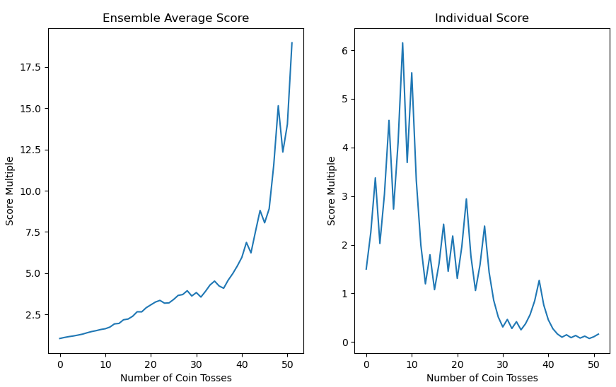

## Introduction

A few years ago, I read some books written by Nassim Taleb concerning problems of randomness, probability, and uncertainty.
Taleb uses the term ergodicity in his writings. However, it was not entirely clear to me what ergodicity really meant. This 
changed recently, when I discovered the [London Mathematical Laboratory](https://ergodicityeconomics.com/) and its research 
about ergodicity which motivated me to write a [Python script](https://github.com/anomalie-im-raum/ergodicity-game-simulation)
and the present blog post about ergodicity, which deserves more attention because of its properties, as it offers important 
insights into many areas such as economics and finance. The findings are astonishing and relevant for everyday life.

This blog post seeks to address the following questions:
What is so interesting about ergodicity and why is it important? And above all: what does ergodicity mean? In order to answer
these questions a common understanding of ergodicity must be established. Let us have a look at the definition of 
[ergodicity](https://en.wikipedia.org/wiki/Ergodicity) in Wikipedia. One might think that the definition provided is too overwhelming.
Fortunately, for the purpose of understanding this blog post, a more modest definition of ergodicity is sufficient.

> Quantities that vary over time and between systems are examined, e.g. wealth of citizens. Often, average values of such variables
are used for analysis. Two kind averages are utilized. First, the time average, it is the average value along a single
long trajectory. Second, the ensemble average or expected value, where the time is fixed, and the average is determined vertically over many different systems. 
The ensemble average is denoted with angled brackets. A randomly varying quantity is called ergodic if these two averages are equal.
If they are, then the stochastic process X(t) is ergodic.

The following plot depicts a stochastic process X(t) with a set of trajectories xn(t), xn of t is the observation, in system
n at time t. Time runs horizontally from left to right and systems run vertically from bottom to top, 5 different 
trajectories are depicted. If these two averages are equal the system is called ergodic.


It is important to distinguish between the two types of averages and their appropriate use. For individual decision-makers 
it is the time average, for collectives such as pension funds it is the ensemble average.

## Methodology

Now that a common understanding of ergodicity is provided, the two remaining questions are answered by the means of gambling. 
A fair coin is tossed, and if it comes up heads, the player wins and its wealth is increased by 50%, if 
it comes up with tails, the player loses, and its wealth is reduced by 40%. The probability for winning and losing is 1/2, 
see equation (1). Thus, the expectation value is (1.5 + 0.6) / 2 = 1.05. In other words, a gain of 5% on each pass is expected.
Based on this information it sounds good to play this game. 


To get some dynamic into our gambling model the game is played many times, e.g. every week for one year. A new score is
generated after a duration of one week, based on the previous score and a randomly generate function based on the defined 
possibilities of 0.6 and 1.5 occurring with probability 1/2, see equations (1) and (2).


The [Python script](https://github.com/anomalie-im-raum/ergodicity-game-simulation) can be used to run some simulations. 
The configuration consits of (a) the factors applied on wealth for winning and losing together with the values for how many
times the coin is tossed in a single game and (b) the number of times a single game is run in parallel.

``` python
ergodicity = Ergodicity(winning_factor=1.5, losing_factor=0.6)
ergodicity.run_process_simulation(nr_coin_tosses=52, nr_of_trials=1000)
```

The script generates a series of coin tosses and calculates the changed wealth by chance. The same code is used
to run some Monte-Carlo simulation to simulate many systems. Then the ensemble average is calculated, and both
scores are plotted.

``` python
    def run_process_simulation(self, nr_coin_tosses, nr_of_trials):
        score = ergodicity.create_coin_toss_series(nr_coin_tosses)
        ensemble_score = ergodicity.monte_carlo_simulation(nr_of_trials, nr_coin_tosses)
        average_score = ergodicity.calculate_finite_ensemble_average(ensemble_score, nr_coin_tosses, nr_of_trials)
        ergodicity.plot_score(range(nr_coin_tosses), score, average_score)
```

## Result

Note that the two plotted sequences vary for each script run. Thus, the depicted plots might look very different from what
what might be obtained when the script is run again.

The plot to the left represents the ensemble score, indicates that playing the game is quite safe. After 52 weeks the gambler 
increased its wealth by more the factor 17. The plot on the right represents the individual score, shows a different picture. 
This is a paradox. After 52 weeks the gambler is almost broke. Contrary to the initial assumption that it might be a good idea to play 
this this gamble, it is not. 



Examination of (a) the relationship between the average wealth of many people and (b) the wealth of a person averaged over time. Note that 
differences in average by chance are eliminated because so many coins are tossed, or one coin is tossed so many times that the law 
of large numbers removes randomness from the averages.

(a) By increasing the number of systems in the ensemble the average converges to the expected value. This reflects the additivity of the
expected value. (1.5 + 0.6) / 2 = 1.05, the already mentioned gain of 5% on each pass.

(b) Along one trajectory a decline that tends towards zero in the long term is shown. This reflects the
multiplicativity of the stated dynamic. 1.5 x 0.6 = 0.9, this equals to a 10% drop over two rounds and 5% in one round respectively. 

## Conclusion

For an individual, the growing expected value has no significance, because as an individual one cannot be cloned, but is bound to one
system, the reality. It seems to be possible to live in an economy where Gross Domestic Product (GDP) increases but individuals have less and less.

What is mathematically expected in the long run may differ from what is mathematically guaranteed to occur in the long run. 
That is confusing. Often what matters is not what is mathematically expected, but what happens on average over time.
This is the ergodicity problem. 

### References
Many thanks to Ole Peters and Alexander Adamou for their [research](https://ergodicityeconomics.files.wordpress.com/2018/06/ergodicity_economics.pdf) and work which this post relies on. 
