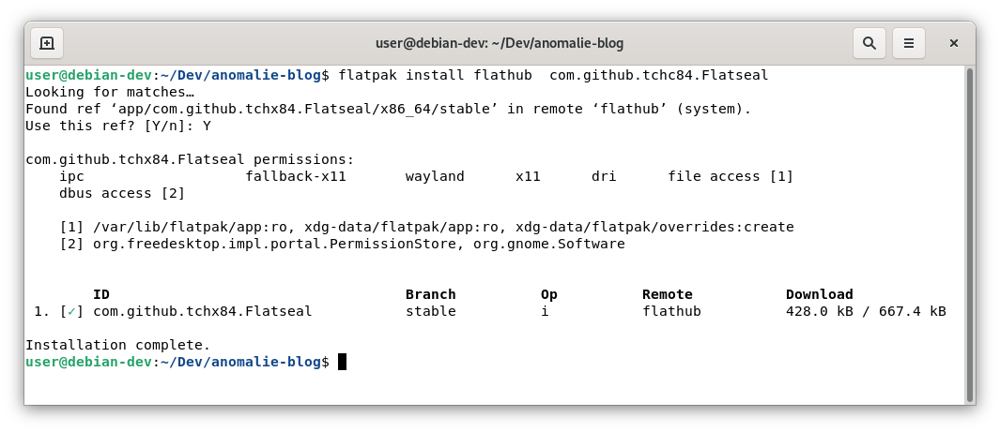
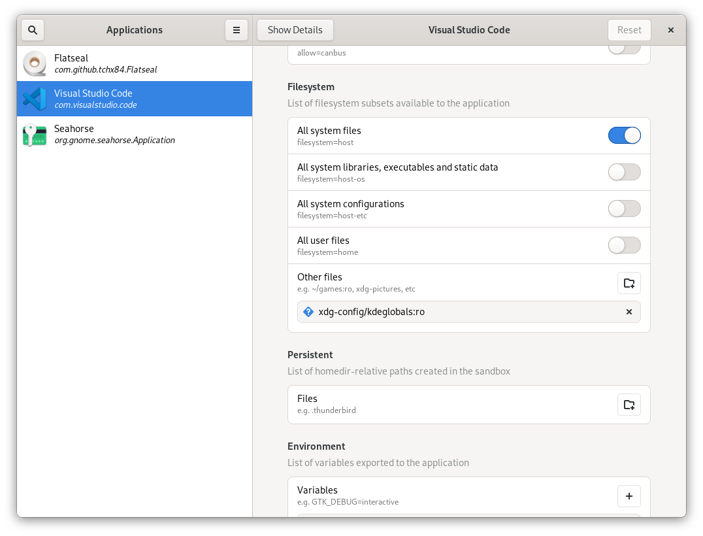

Flatpak uses container technology to run apps on different Linux distributions. Consequently the app development is easier because all the needed dependencies are included in the container. Furthermore, there is a [Central Repository](https://flathub.org/home) where you can search for your favourite apps.

Most of the time I use Debian stable, the biggest advantage of Flatpak for me is that I no longer have to rely on Debian backports to get the latest version of an app. I like Debian a lot, but some packages that come with the stable version are pretty outdated. I don't care much about the Nautilus version or anything like that. On the other hand, for security related issues - browsers, password managers and so on, I prefer to use the latest version of an app.

However, there is no advantage without a disadvantage. One feature of Flatpaks is that they run in a sandbox to isolate them from the host. This increases the security, on the other hand it makes it more difficult for the app running in the sandbox to make changes on the host, e.g. save a file, because the app does not have permission on the the underlying file system.

The permissions can be changed with the flatpak override commands. The objective of [Flatseal](https://flathub.org/apps/details/com.github.tchx84.Flatseal), a graphical utility for checking and changing the basic permissions of your Flatpak apps, is to facilitate this process.

How to install and run Flatseal from the console:
``` bash
flatpak install flathub  com.github.tchc84.Flatseal
flatpak run com.github.tchx84.Flatseal
```



