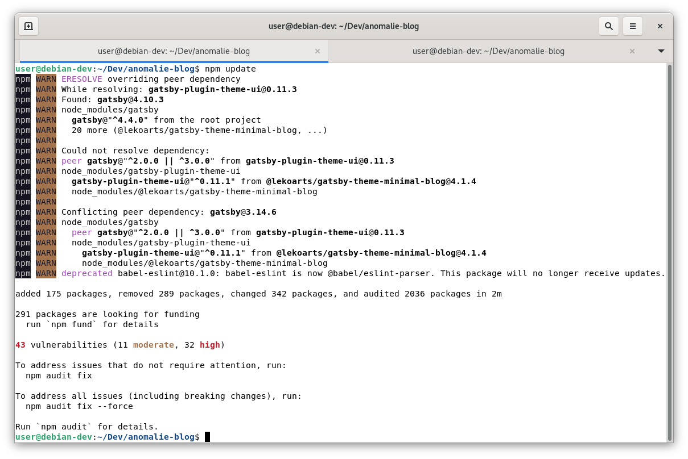

## Introduction

The present anomalie blog, like many other things, is made up of software.
To keep a software up-to-date in order to mitigate security vulnerabilities caused by outdated software packages is a challenging area in operations. 

There are various software solution variants for setting up a blog.
One of them is to utilise a content management system (CMS), another is to utilise a static site generator. 
The former variant is better suited for a major blog, the latter variant is better suited for a minor blog like the present one.
A static website generator converts a blog post into a static page without dynamic rendering and therefore loads the page very quickly in the viewer's browser. Due to this advantageous feature static web site generators have received much attention in the recent years. Two mature and widespread representatives of this software are [Hugo](https://gohugo.io/) and [Gatsby](https://www.gatsbyjs.com/). The former is a Go based framework; the latter is React based framework utilising JavaScript.
Because JavaScript is of growing interest to the Author the choice fell on Gatsby, although the learning curve is steeper compared to Hugo.

However, theoretical knowledge about something does not mean that it can be put into practice.

This blog post closes this gap, it describes a procedure to identify outdated Gatsby packages and how to conduct bug-fixes and security-patches to keep the software up-to-date.

## Methodology

The procedure was conducted on Debian bullseye release. 
The packages that constitute this blog are managed by the package manager [npm](https://www.npmjs.com/), the runtime environment is provided by [node.js](https://nodejs.org/en/). 

The procedure consists of three steps. 
In the first, the current version of the utilised packages was determined. 
Second, these packages were updated to the latest available version. 
Finally, the result of the update was validated by launching the blog and checking its functionality.
During this, the term semantic versioning was also introduced and explained.

By running the command `npm outdated` on the console the outdated dependencies of the project anomalie-blog were listed. 
The dependencies are defined in the package.json file of the blog.
The figure below depicts the package number in three categories: current, wanted, latest.
Current is the present utilised package version, wanted is the highest package version satisfying the [semantic versioning](https://semver.org/) range specified in package.json, latest is the package version of the package tagged as latest in the package repository/registry.
Semantic versioning is utilised to tag new versions and indicate what kind of changes are introduced in every new release.


The subsequent figure "blog-dependencies" illustrates the dependencies defined in package.json. 
Note the two highlighted packages "gatsby-plugin-google-analytics" and "gatsby-plugin-google-gtag".
These two serve the identical purpose, which is to integrate Google Analytics into the blog.
The latter plugin was added without removing the former. 
This is a minor deficit that will cause an error when updating the dependencies as depicted in the figure after next.
However, this deficit makes the experiment more realistic.

The version is defined by MAJOR.MINOR.PATCH, with the addition of a preceding symbol, either "~" (tilde) meaning only updating patch release, or "^" (caret) which means that both patch and minor releases are updated. 
Details about the semantics of the symbols are reported in this [source](https://nodejs.dev/learn/semantic-versioning-using-npm).

```json:title=blog-dependencies {7-8}
 "dependencies": {
    "@lekoarts/gatsby-theme-minimal-blog": "^4.0.0",
    "gatsby": "^4.0.0",
    "gatsby-omni-font-loader": "^1.3.1",
    "gatsby-plugin-feed": "^4.0.0",
    "gatsby-plugin-gatsby-cloud": "^4.0.0",
    "gatsby-plugin-google-analytics": "^3.6.0",
    "gatsby-plugin-google-gtag": "^4.9.0",
    "gatsby-plugin-manifest": "^4.0.0",
    "gatsby-plugin-sitemap": "^5.0.0",
    "gatsby-plugin-webpack-bundle-analyser-v2": "^1.1.22",
    "react": "^17.0.2",
    "react-dom": "^17.0.2"
  }
```

Now that the current version of the packages is known, it is time to bring them up to date.
The update is performed by the `npm update` command. 
The expectation of the execution of the `npm update` command was twofold. 
Firstly, that the dependency tree would remain unbroken. 
Secondly, that all minor versions and patches would be updated. 
For example, that the gatsby package will be updated to the latest version of 4.10.3, due to the rules of semantic versioning. 
The figure below illustrates the execution of the command and the resulting error.


The cause of the error is now analysed in more detail.
The dependency of the gatsby-plugin-google-analytics package to the gatsby package cannot be resolved anymore.
The original version of the gatsby package at the time of cloning the anomalie blog from the minimal blog repository was 3, the currently available version of the gatsby package used in the anomalie blog blog is 4. 
Therefore, the dependency cannot be resolved.
The problem could be overcome by removing the no longer used plugin from the dependencies. 
Subsequently, an update could be performed successfully. 

The figure below depicts that some dependencies from the minimal blog cannot be resolved.
These issues are classified as warnings; therefore, this is considered not significant. 
To validate this assumption the blog was started and tested successfully.



The below figure depicts the sole package with an outdated version after executing the update command. 
This package is kept unchanged in package.json because the identical configuration is still used in the minimal blog template from which this blog was cloned from.
However, no negative effects were found. Moreover, the author of the minimal blog template is trusted as subject matter expert, therefore the issue was not investigated further. 


## Result

As outlined in the introduction, keeping a software up-to-date in order to mitigate security vulnerabilities is a challenge. 
The main purpose of this work was to develop a procedure to identify outdated Gatsby packages and how to conduct bug-fixes and security-patches.
On the whole, the procedure has proved successful.
As evident from the figure above, which shows the error message after running the `npm update` command the first time, some obstacles are to be expected during the process.
This indicates that an update must always be carried out with caution and warnings must be taken seriously, otherwise the process can lead to broken software. 

## Conclusion

In this blog post, a procedure for updating software was successfully presented. 
The presented procedure is analogous to that of [advanced package tool (apt)](https://wiki.debian.org/Apt), Debian's command-line package manager.